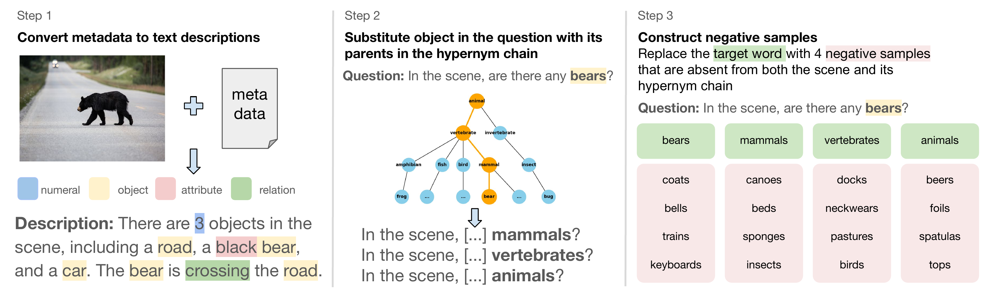

<div align="center">

# Vision-and-Language Training Helps Deploy Taxonomic Knowledge but Does Not Fundamentally Alter It

**Yulu Qin**¹*, **Dheeraj Varghese**²*, **Adam Dahlgren Lindström**³, **Lucia Donatelli**⁴, **Kanishka Misra**⁵†, **Najoung Kim**¹†

¹Boston University, ²University of Amsterdam, ³Umeå University, ⁴Vrije Universiteit Amsterdam,⁵Toyota Technological Institute at Chicago

*, † Equal contribution

[Paper]() | [Website](xonomigqa.github.io/) | [Dataset 🤗](https://huggingface.co/datasets/tin-lab/TaxonomiGQA)

</div>

# Requirements
To install the necessary dependencies, run: 
```
pip install -r requirement.txt
```
# TaxonomiGQA

TaxonomiGQA is a dataset constructed on top of GQA following a three-step pipeline.



It contains:
- **1342 GQA images:** a subset of images from the original GQA dataset  
- **148020 questions** in Two QA formats
  - **Text-only QA**  
    - Each image is represented by a scene description.  
    - Questions refer only to the textual description.  
  - **Image-QA**  
    - Matches the original GQA setup: image + visual question.

You have two options for obtaining the TaxonomiGQA dataset:
1. **Download from Hugging Face (Recommended)**: The processed datasets(both text-only and image-QA splits) are readily avilable on Huggingface at `tin-lab/TaxonomiGQA`. The inference script (`run_inference.py`) will automatically download these when executed. 
2. **Regenerate QAs from Scratch**: if you prefer to regenerate the QAs yourself, execute the following script: 
```
python multimodal-representations/src/preprocessing/run_pipeline.py
```
This will output two .csv files in your working directory:
- model_inference_input_text.csv
- model_inference_input_image.csv

Note: To run inference based on the QA data generated using the aforementioned script, you will need to provide the images corresponding to the 1342 TaxonomiGQA subset. These images can be obtained in one of the two ways:
- Download the full GQA images zip file from the original website[](https://downloads.cs.stanford.edu/nlp/data/gqa/images.zip) 
- Download only the 1342 TaxonomiGQA images directly from our `tin-lab/TaxonomiGQA` Hugging Face dataset. 
You would then point the `run_pipeline.py` script to the local directory of these images and QA files previously generated. 

## Inference Configuration

Model and experiment configurations are defined in YAML files under 
`src/configs/`. A sample config file `vlm_text_qwen2.5VL.yaml` is provided. You can run:
```
python src/configs/generate_config.py
```
to generate all config files needed for this paper. 

## Running Inference

To run inference for a specific model, use:
```
python run_inference.py --config="src/configs/vlm_text_qwen2.5VL.yaml"
```
This script load data automatically from huggingface datasets repository:
`tin-lab/TaxonomiGQA`
and writes model outputs to:
`data/behavioral-data/vlm_text_qwen2.5VL.csv`.
Each model will produce a separate .csv file named after its config.

### Aggregated Results

After running inference with each model individually, you will obtain separate .csv files containing the model predictions and whether each answer from the model is correct. These individual results can be aggregated into a single file that summarizes model performance across all models by simply running: 
```
python data/behavioral-data/aggregate_model_res.py 
```
The aggregated results (across multiple models) will be stored as:
`data/behavioral-data/model_inference_output.csv`, which will serve as an input file for later analyses.

# Analyses
## TAXOMPS

Generate stimuli using:

```bash
python src/flatten_taxonomy.py # creates unique hypernym pairs

python src/taxomps-computemax-stimuli.py # creates all stimuli
```

Run models using:
```bash
bash scripts/taxomps.sh
```

This script saves results in the following directories:
* `data/results/taxomps-hypernym-qa` -- for hypernyms (positive samples)
* `data/results/taxomps-ns-all-qa` -- negative samples
* `data/results/taxomps-swapped-qa` -- for cases where we swap hypernym and hyponym (unused in paper).

To get plots, run the following R script: `analysis/gqa-taxomps-analysis.R`


## RSA Analysis

The following script runs the Park et al., method and saves results in:
* `data/results/pair-rsa.csv` -- for RSA metrics
* `data/reps/<modelname>/long-mats/` -- for pairwise similarities

```bash
bash scripts/rsa.sh
```

To get plots, run the following R scripts: 
* `analysis/rsa-plots.R`-- for matrices
* `analysis/rsa-analysis.R` for tests

## Embedding Analysis:

The following runs the embedding similarity analysis:
```bash
python src/embedding_analysis/embedding_similarity.py \
  --emb_unemb emb \
  --results_dir data/results/embedding_analysis/
```

## Contextualized Representational Similarity Analysis

Get Qwen2.5 data by running `analysis/everything-qwen.R`, then run:

```bash
bash scripts/cwe-sims.sh
```

This will save results in `data/results/gqa-cwe-sims-all/<modelname>`

To get plots, use the following R script: `analysis/token-sim-analysis-qwen-all-no-questions.R`

## PCA

Data used: same as previous section (Contextualized Representation Similarity) but now for PCA. 

Run `src/pca-interactive.ipynb` to run exps and save data.

Then, run `analysis/pca-analysis.R` to get pca plots.


## Image Similarity Analysis

To compute visual similarity between taxonomy nodes using Qwen2.5-VL 

```bash
cd src/similarity_analysis/code/

python compute_taxonomy_sims_image.py \
  --nonleaf_out_pkl ../data/qwen_nl_node_to_embeds.pkl \
  --leaf_out_pkl ../data/qwen_leaf_node_to_embeds.pkl \
  --sim_csv_out ../data/qwen_substituted_edge_accuracy.csv \
  --model Qwen \
  --model_type vlm-text
```

#### Arguments

* `--nonleaf_out_pkl`: Path to save or load non-leaf node image embeddings (as a pickle file).
* `--leaf_out_pkl`: Path to save or load leaf node image embeddings (as a pickle file).
* `--sim_csv_out`: Output CSV file to store similarity scores between concept pairs.
* `--model`: Name of the model used (e.g., `Qwen`, `llava`).
* `--model_type`: Type of model (e.g., `vlm-text`) used for filtering concept pairs.

#### Input Data

* **Taxonomy**: `data/arg_hypernyms.json` – maps leaf concepts to their ancestors.
* **Annotations**: `data/combined.json` – maps concepts to THINGS image folders.
* **Images**: Located under `data/THINGS/object_images/`.
* **Concept Pairs**: `data/model_substituted_edge_accuracy_with_vlm.csv` – includes model accuracies for concept pairs.

#### Output

* Embeddings for each concept (leaf and non-leaf) saved as pickle files.
* CSV file with computed cosine similarity scores between concept pairs.

To generate plot (fig 6) and run statistical analysis, use:

```
analysis/viz-sim.R
```


## Citation

If you use the code in this work or use our results, please cite us using:

```bibtex
@article{qin2025taxonomi,
        title={Vision-and-Language Training Helps Deploy Taxonomic Knowledge but Does Not Fundamentally Alter It},
        author={Qin, Yulu and Varghese, Dheeraj and Lindström, Dahlgren Adam and Donatelli, Lucia and Misra, Kanishka and Kim Najoung},
        journal={arXiv preprint},
        year={2025}
        }
```
